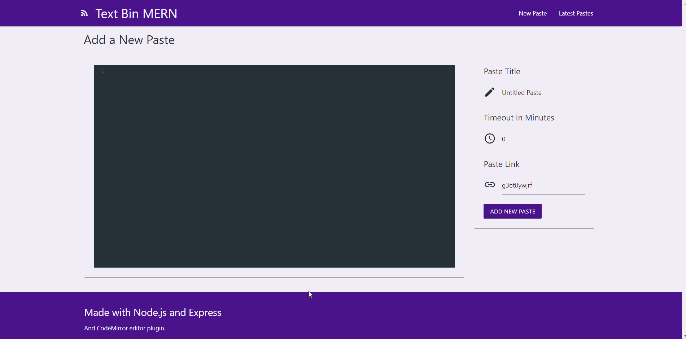

# Text Bin MERN

An implementation similar to that of Pastebin and other text storage websites, using the MERN stack. Each paste can be customized with a title, custom short URL and the expiry time after which the paste would be automatically deleted form the database. The latest pastes tab shows all the pastes submitted previously.

## Preview

## Available Scripts

In the project directory, you can run:

### `npm start`

Runs the app in the development mode.\
Open [http://localhost:3000](http://localhost:3000) to view it in the browser.

The page will reload if you make edits.\
You will also see any lint errors in the console.

### `npm run build`

Builds the app for production to the `build` folder.\
It correctly bundles React in production mode and optimizes the build for the best performance.

The build is minified and the filenames include the hashes.\
Your app is ready to be deployed!

See the section about [deployment](https://facebook.github.io/create-react-app/docs/deployment) for more information.